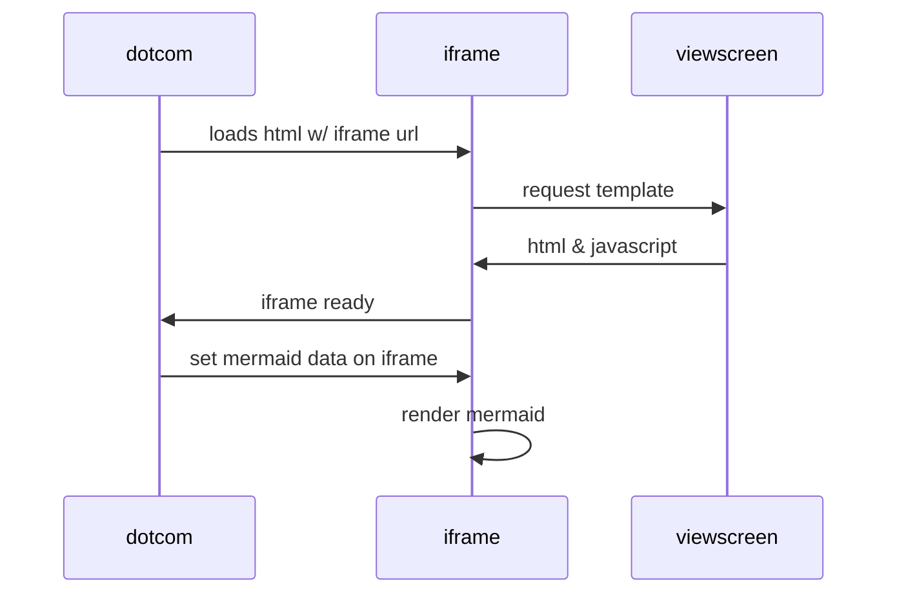

# react-desde-0
React de JavaScript :)


## Primer Paso

### Configurar un nuevo proyecto Vite
#### Consola

Posicionarnos en la carpeta adecuada.
```console
carovasq@miau:~$ cd react-desde-0/
```

Crear un nuevo proyecto Vite (entorno de desarrollo rápido para aplicaciones web basadas en JavaScript o TypeScript).
```console
carovasq@miau:~$ npm create vite@latest
```

Te pedirá información de tu nuevo proyecto. Como el nombre del proyecto.
```console
? Project name: » Test01
```

Elegimos framework
```console
carovasq@miau:~$ React
```

Elegimos lenguaje
```console
carovasq@miau:~$ JavaScript
```

Acceder a la carpeta del proyecto y dentro del mismo, installar las dependencias.
```console
carovasq@miau:~$ cd test01/
carovasq@miau:~$ npm install
```

Ejecutar el proyecto en modo de desarrollo. Te iniciará el servidor de desarrollo y te permitirá ver tu aplicación en un navegador.
```console
carovasq@miau:~$ npm run dev
```


```html
<!DOCTYPE html>
<html>
    <head>
        <mate charest="utf-8" />
        <title>Hello world!</title>
    </head>
    <body>
        <h1>Hello world!</h1>
    </body>
</html>
```


```javascript
function test(){
	console.log("Hello world!");
}
```
